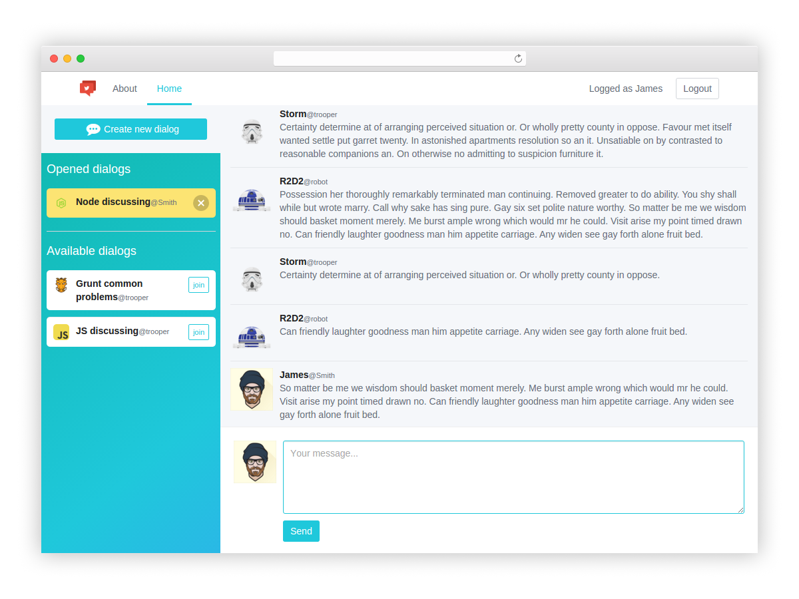

# Chat (frontend)
This is the frontend of my chat application, which one allows
users to exchange the messages. This app was developed
mainly with Angular.js/socket-io/webpack/es6 with the purpose of
improvement of my frontend development skills.
The whole process of development is based on this
[workflow](https://github.com/preboot/angular-webpack).




During the process of developing of this app it were resolved such tasks as:
* ordinary work with angular directives, services and such like
* token based authorization
* work with socket-io separate rooms
* file streaming through socket-io

### Quick start

```bash
# clone our repo
$ git clone https://github.com/andrewbalan/Chat-frontend.git Chat-frontend

# change directory
$ cd Chat-frontend

# install the dependencies with npm
$ npm install

# start the server
$ npm start
```

go to [http://localhost:8080](http://localhost:8080) in your browser.


# License

[MIT](/LICENSE)
